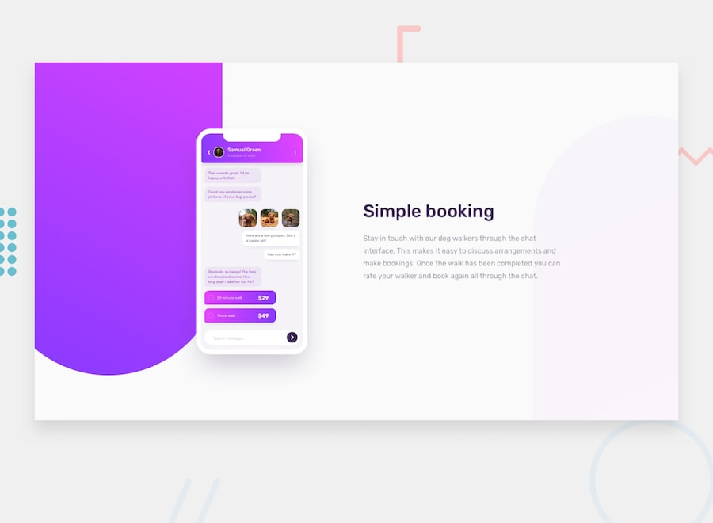

# Frontend Mentor - Chat app CSS illustration solution

This is a solution to the [Chat app CSS illustration challenge on Frontend Mentor](https://www.frontendmentor.io/challenges/chat-app-css-illustration-O5auMkFqY). 

## Table of contents

- [Overview](#overview)
  - [The challenge](#the-challenge)
  - [Screenshot](#screenshot)
  - [Links](#links)
- [My process](#my-process)
  - [Built with](#built-with)
  - [What I learned](#what-i-learned)
  - [Continued development](#continued-development)
- [Author](#author)

## Overview

### The challenge

Users should be able to:

- View the optimal layout for the component depending on their device's screen size
- **Bonus**: See the chat interface animate on the initial load

### Screenshot

### Links

- Solution URL: [link to the github repo](https://github.com/johakim-azix/chat-app-illustration)
- Live Site URL: [live site URL here](https://johakim-azix.github.io/chat-app-illustration/)

## My process
I started by building the views (html, css) for mobile screens, while thinking of bigger screens; i haven't build the whole DOM structure before styling! i worked step by step.
 Once i was done building views started with full css animations and transitions, and i ended implemention javascript for some advance animations that needed some DOM manipulation. 
### Built with

- HTML5 
- CSS custom properties
- CSS animations
- CSS transitions
- Flexbox
- Vanilla js

### What I learned

With this challenge, i made my first steps with animation using css, chaining them, delaying them and so on ... i also dived deeper using transitions, all this was in order to avoid building poor user experience on upcoming apps i'll work on.

### Continued development

For sure i'll keep working on adding more animations and transition on my pages. 
Till now i wasn't really using them, i didn't even know how to build some of them specially animations!!!
I was always shocked by these amazing motions i used to see on dribbble without knowing how to build them. 
But now i know them and it's amazing how they can radically change user experience.
 

## Author
- Frontend Mentor - [@johakim-azix](https://www.frontendmentor.io/profile/johakim-azix)
- Github  - [johakim-azix](https://github.com/johakim-azix/)
- Twitter - [@marlonneazix](https://twitter.com/marlonneazix)
- Instagram - [@marlonne_penda](https://www.instagram.com/marlonne_penda/)

